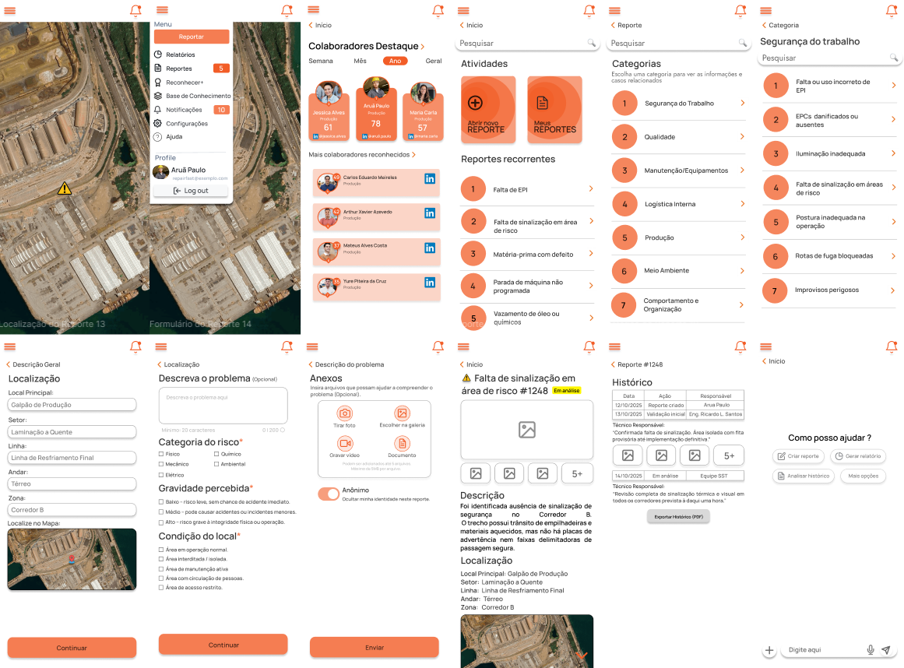
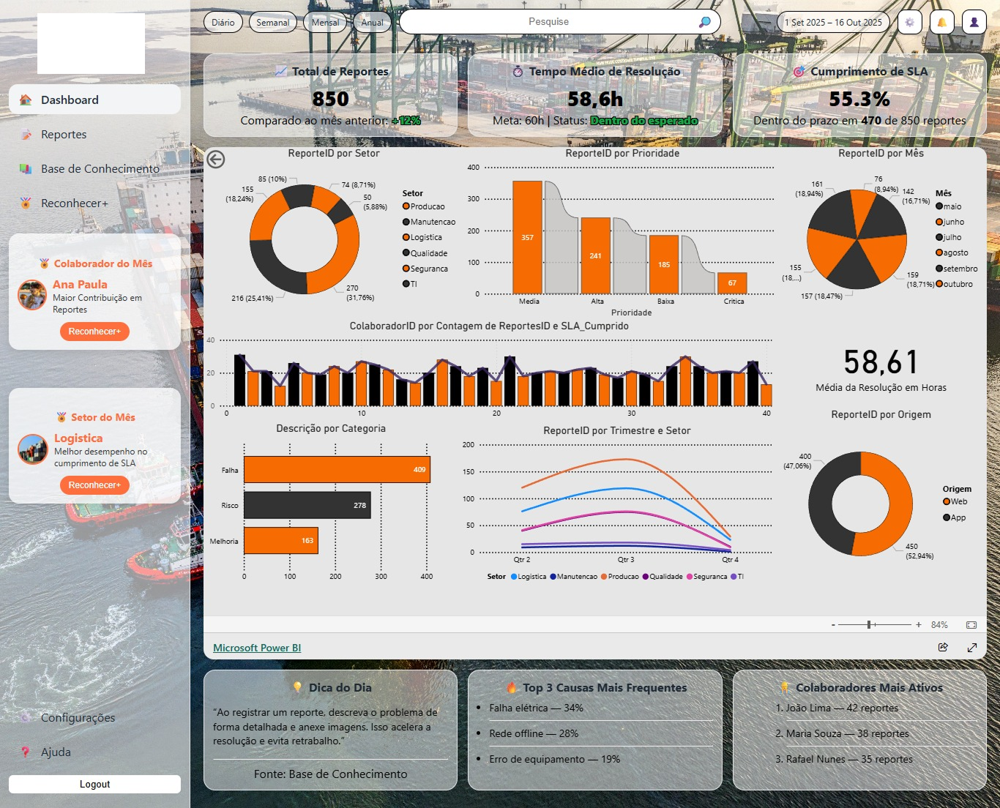
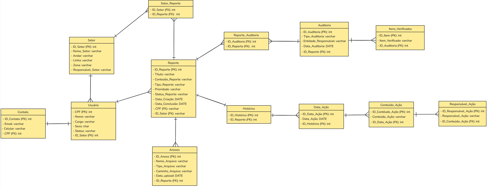
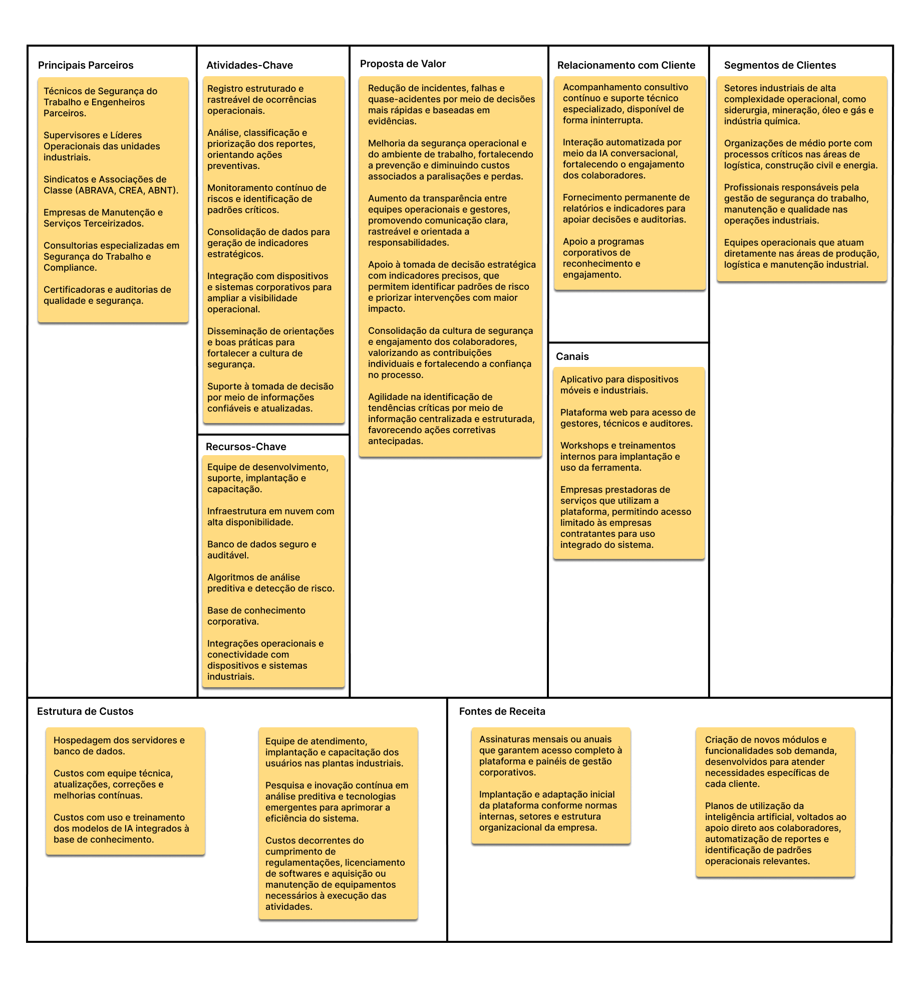
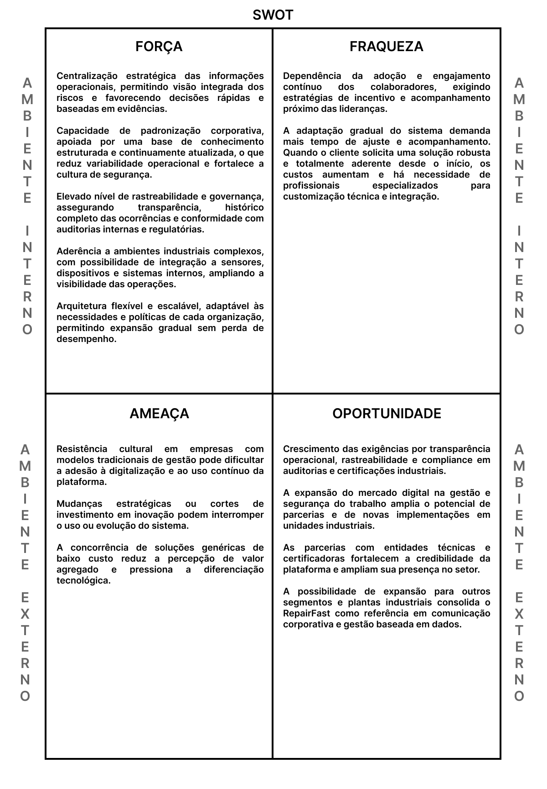

# RepairFast

**Plataforma Inteligente para Gestão Preventiva e Comunicação Industrial**

---

## Sobre o Projeto

O RepairFast é uma plataforma digital voltada à gestão preventiva e à comunicação estruturada de riscos em ambientes industriais. O projeto foi concebido para apoiar organizações na identificação, registro, acompanhamento e análise de ocorrências operacionais, promovendo maior rastreabilidade das informações e fortalecimento da cultura de segurança.

### Contexto e Problemática

A gestão de riscos operacionais em ambientes industriais depende diretamente da qualidade da comunicação, da rastreabilidade das informações e da capacidade de transformar ocorrências em aprendizado preventivo. No entanto, na prática, muitas organizações ainda operam com:

- Processos fragmentados e registros informais
- Ausência de acompanhamento estruturado das ocorrências
- Falhas comunicacionais e subnotificação de eventos
- Registros incompletos e falta de padronização
- Dificuldade na identificação de padrões de risco
- Baixa integração entre setores e falta de retorno sobre ocorrências

Essas fragilidades comprometem a eficácia das ações de segurança e podem resultar em consequências graves, como demonstrado em casos amplamente divulgados no país, incluindo o rompimento da barragem de Brumadinho e incidentes hospitalares que evidenciaram falhas estruturais de comunicação e monitoramento.

---

## Objetivos

### Objetivo Geral

Desenvolver uma plataforma digital voltada à gestão preventiva e à comunicação estruturada de riscos em ambientes industriais, com o propósito de reduzir falhas comunicacionais, ampliar a rastreabilidade das informações e fortalecer a cultura de segurança por meio do registro, acompanhamento e análise sistemática de ocorrências operacionais.

### Objetivos Específicos

1. Estruturar um fluxo padronizado de reporte de ocorrências, capaz de garantir consistência, clareza e completude das informações registradas.

2. Possibilitar a rastreabilidade completa do ciclo de vida das ocorrências, desde o registro inicial até sua resolução final.

3. Facilitar o monitoramento contínuo dos riscos, permitindo acompanhamento em tempo real do status das ocorrências e das ações associadas.

4. Apoiar a tomada de decisão baseada em dados, por meio da consolidação de informações e indicadores relevantes para a gestão de riscos.

5. Promover maior integração entre equipes operacionais, técnicas e gestores, reduzindo a fragmentação da comunicação.

6. Contribuir para o fortalecimento da cultura de segurança, incentivando o registro de situações de risco, quase-acidentes e ocorrências preventivas.

7. Assegurar que a solução esteja alinhada a práticas contemporâneas de segurança do trabalho, transparência organizacional e melhoria contínua.

---

## Funcionalidades Principais

### Módulo Mobile - Reporte e Recursos Complementares



- Registro de ocorrências por meio de formulários dinâmicos configurados por tipo
- Associação de evidências multimídia (fotos, vídeos, áudios) ao reporte
- Geolocalização automática do ponto de ocorrência
- Categorização e classificação de riscos
- Visualização das ocorrências em mapa interativo
- Base de conhecimento organizacional estruturada
- Apoio operacional por meio de inteligência artificial conversacional
- Mecanismos de engajamento e reconhecimento dos colaboradores
- Sistema de notificações automáticas
- Triagem e priorização de ocorrências
- Interface simplificada para trabalhadores operacionais

### Módulo Web - Gestão e Análise



- Acompanhamento integral do ciclo de vida das ocorrências
- Histórico cronológico completo de todas as alterações
- Monitoramento contínuo do status das ocorrências
- Gestão de procedimentos e ações preventivas associadas
- Dashboard analítico para consolidação de indicadores
- Geração automática de relatórios em formato PDF

---

## Arquitetura e Modelagem

### Stack Tecnológico

**Prototipação:**
- Mobile: Figma
- Web: HTML e CSS
- Analytics: Microsoft Power BI

**Implementação (planejada):**
- Backend: Python com framework FastAPI
- Banco de Dados: MySQL (relacional)

### Modelagem de Dados

A arquitetura de dados contempla as seguintes entidades principais:



A estrutura relacional assegura rastreabilidade, consistência e flexibilidade, permitindo acompanhar cada ocorrência desde o registro até o encerramento, e sustentando as funcionalidades de análise, comunicação e monitoramento contínuo.

---

## Análise Estratégica

### Business Model Canvas

O modelo de negócio do RepairFast estrutura-se nos seguintes elementos:



---

### Matriz SWOT



---

## 👥 Stakeholders

### Stakeholders Primários
- 👷 **Trabalhadores operacionais** - Registro de ocorrências
- 🦺 **Técnicos de segurança** - Análise e acompanhamento

### Stakeholders Secundários
- 👨‍💼 **Supervisores e gestores** - Tomada de decisão
- 👨‍🔧 **Engenheiros de segurança** - Análises técnicas aprofundadas

### Stakeholders de Suporte
- 💻 **Equipe de TI** - Manutenção e suporte técnico
- 📋 **Auditores** - Verificação de conformidade

### Stakeholders Institucionais
- 🏢 **Direção e alta gestão** - Resultados estratégicos
- ⚖️ **Órgãos reguladores** - Conformidade regulatória

---

## 📊 Resultados Esperados

### Indicadores de Impacto

| Métrica | Antes | Depois | Melhoria |
|---------|-------|--------|----------|
| ⏱️ Tempo médio de resposta | 3,0 dias | 1,6 dias | **-46,7%** |
| ✅ Taxa de execução de ações | 68% | 87% | **+19%** |
| 👥 Participação dos setores | Parcial | Integral |  |

Fonte: Elaborado por Silva et al. (2025), adaptado de Costa et al.(2022).

### Benefícios Organizacionais

- ✅ Redução de incidentes e acidentes
- ✅ Fortalecimento da cultura de segurança
- ✅ Maior transparência e rastreabilidade
- ✅ Decisões baseadas em dados
- ✅ Conformidade com normas regulamentadoras
- ✅ Otimização de recursos
- ✅ Melhoria contínua dos processos

---

## 🌍 Alinhamento com ODS da ONU

<div align="center">
  
### ODS 8 - Trabalho Decente e Crescimento Econômico
Promovendo ambientes de trabalho seguros e produtivos

### ODS 9 - Indústria, Inovação e Infraestrutura
Incentivando inovação tecnológica aplicada à gestão de riscos

</div>

---

## 📂 Estrutura do Repositório

```
Repairfast/
├── docs/                                       
│   ├── 01-visao-geral.md      
│   ├── 02-problema-e-contexto.md
│   ├── 03-objetivos.md
│   ├── 04-stakeholders.md
│   └── 05-requisitos-funcionais.md
├── prototipos/                 
│   ├── linkdofigma.md
│   ├── Logo.png
│   ├── MOBILE.png
│   └── WEB.png                                
├── diagrams/
│   └── MER.png                 
├── planejamento/
│   ├── SWOT.png
│   └── CanvaBusiness.png
├── artigos/
│   └── REPAIRFAST_ PLATAFORMA_INTELIGENTE_PARA_GESTÃO_PREVENTIVA_E_COMUNICAÇÃO_INDUSTRIAL.pdf     
└── README.md
```

---

## 🔧 Requisitos Funcionais

### RF01 - Registro de ocorrências
Formulários dinâmicos configurados por tipo de ocorrência.

### RF02 - Evidências multimídia
Associação de fotos, vídeos e áudios aos reportes.

### RF03 - Ciclo de vida completo
Rastreabilidade e histórico cronológico de todas as ações.

### RF04 - Priorização de riscos
Suporte ao tratamento e organização de ações preventivas.

### RF05 - Dashboard analítico
Consolidação de dados para suporte à decisão.

### RF06 - Visualização espacial
Mapa interativo com geolocalização de ocorrências.

### RF07 - Engajamento
Gamificação e reconhecimento de colaboradores.

### RF08 - Base de conhecimento
Armazenamento estruturado de informações.

### RF09 - IA conversacional
Apoio operacional e orientações inteligentes.

---

## 🚧 Status Atual do Projeto

**Fase Atual:** Conceitual Validada

### ✅ Concluído
- Definição de funcionalidades
- Prototipação mobile (Figma)
- Prototipação web (HTML/CSS)
- Modelagem conceitual do banco de dados
- Documentação técnica completa
- Análise estratégica (SWOT + Canvas)
- Dashboard analítico (Power BI)

### 🔄 Em Planejamento
- Implementação do backend (Python + FastAPI)
- Desenvolvimento do frontend mobile (Em planejamento)
- Desenvolvimento do frontend web (Em planejamento)
- Integração com banco de dados MySQL
- Testes e validação com usuários reais

### 🎯 Roadmap Futuro
- MVP funcional
- Integração com sistemas existentes
- Módulo de IA e Machine Learning
- Aplicativo mobile 
- Expansão para outros segmentos

---

## 🔗 Links Importantes

- 🎨 [Protótipo no Figma](https://www.figma.com/design/nZCn20XO779sq2lspaCHsg/RepairFast?node-id=41-626&p=f&t=cX7QReIQGKBcHgOD-0)
- 📄 [Artigo Científico Completo](docs/REPAIRFAST_PLATAFORMA_INTELIGENTE.pdf)
- 📊 [Dashboard Power BI](#) (em desenvolvimento)
- 📚 [Documentação Técnica](docs/)

---

## 👨‍💻 Equipe de Desenvolvimento

- **Arthur Xavier dos Santos**
- **Aruã Paulo Pereira da Silva**
- **Carlos Eduardo Pisa Meirelles**
- **Mateus Alves Costa**
- **Yure Piteira da Cruz**

**Orientação:** Prof. Alexandre Barbosa de Souza

---

## 📚 Referências

GONÇALVES FILHO, A. P. **Cultura e gestão de segurança no trabalho em organizações industriais**: uma proposta de modelo. Tese (Doutorado) - Universidade Federal da Bahia, 2011.

SILVA, B. A. M. et al. Desenvolvimento de sistema de controle de risco na engenharia de segurança do trabalho. **Revista Ibero-Americana de Humanidades, Ciências e Educação**, v. 11, n. 8, 2025.

ORGANIZAÇÃO DAS NAÇÕES UNIDAS. **Objetivos de Desenvolvimento Sustentável**. Disponível em: https://brasil.un.org/pt-br/sdgs

---

## 📄 Licença

Este projeto é de propriedade acadêmica e foi desenvolvido como Projeto Integrador de Extensão. Todos os direitos reservados.

---

## 📞 Contato

Para mais informações sobre o projeto, entre em contato através dos canais abaixo.

---

<div align="center">
  
**RepairFast** - Transformando a gestão de segurança industrial através da tecnologia

[]([https://linkedin.com](https://www.linkedin.com/in/mateusalvescosta/))
[](mailto:mateuscosta3497@gmail.com)

</div>
